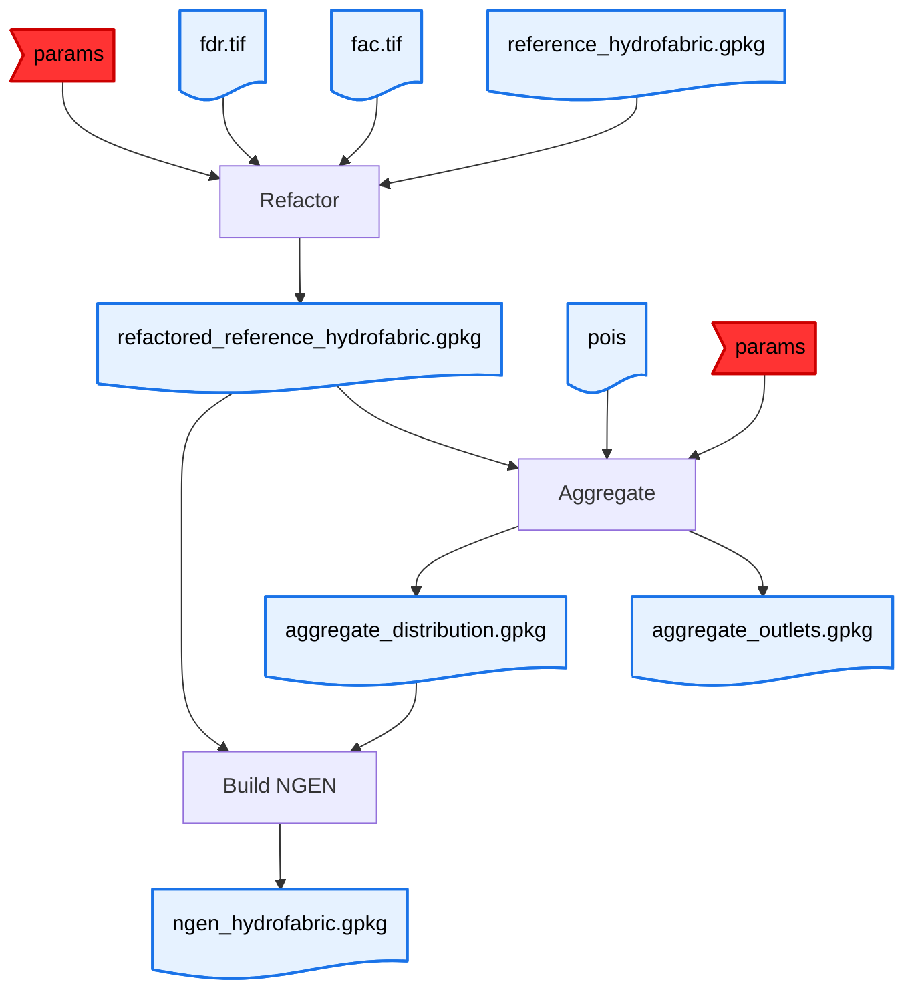

# Overview of the NGEN HydroFabric Workflow

The following outlines the general workflow for generating an NGEN Hydrofabric from the Reference Hydrofabric, as we currently understand it.

```mermaid
graph TD;

  classDef data fill:#e6f2ff,stroke:#1a73e8,stroke-width:2px,color:#000;
  classDef params fill:#ff3333,stroke:#cc0000,stroke-width:2px,color:#000;

  refactor[Refactor];
  aggregate[Aggregate];
  ngen[Build NGEN];

  Input_ref@{ shape: doc, label: "reference_hydrofabric.gpkg" }
  class Input_ref data

  Input_fac@{ shape: doc, label: "fac.tif"}
  class Input_fac data

  Input_fdr@{ shape: doc, label: "fdr.tif"}
  class Input_fdr data

  Out_refactored@{ shape: doc, label: "refactored_reference_hydrofabric.gpkg"}
  class Out_refactored data

  Out_agg_outlets@{ shape: doc, label: "aggregate_outlets.gpkg"}
  class Out_agg_outlets data

  Out_agg_dist@{ shape: doc, label: "aggregate_distribution.gpkg"}
  class Out_agg_dist data

  Out_ngen@{ shape: doc, label: "ngen_hydrofabric.gpkg"}
  class Out_ngen data
  
  Input_pois@{ shape: doc, label: "pois"}
  class Input_pois data

  params_refactor@{ shape: odd, label: "params" }
  class params_refactor params

  params_agg@{ shape: odd, label: "params" }
  class params_agg params

  Input_ref --> refactor;
  Input_fac --> refactor;
  Input_fdr --> refactor;
  params_refactor --> refactor;

  refactor --> Out_refactored;
  Out_refactored --> aggregate;
  Input_pois --> aggregate;
  params_agg --> aggregate;

  aggregate --> Out_agg_outlets;
  aggregate --> Out_agg_dist;

  Out_agg_dist --> ngen;
  Out_refactored --> ngen;
  ngen --> Out_ngen

  

```
